# Debian 10 och Nginx Server Blocks

I guiden används en och samma server för olika webbserverspråk.    

- 80: nginx (default)
- 8081: Hello World
- 8082: PHP, MariaDB, och Wordpress 
- 8083: Node.js med nginx som proxy server
- 8084: Deno med nginx som proxy server


I exemplet har servern följande ip-adress: 172.104.246.137. *Se till att byta ut det för att passa din konfigurering*.

*Uppdatera Debian*

Logga in med ditt root konto och uppdatera systemet. 

`apt-get update && apt-get upgrade`


## Installera webbservern Nginx
Nginx är en webserver som bland annat används som http server och proxy server. Nginx är open source och installeras med kommandot *apt install nginx*.

`sudo apt install nginx`

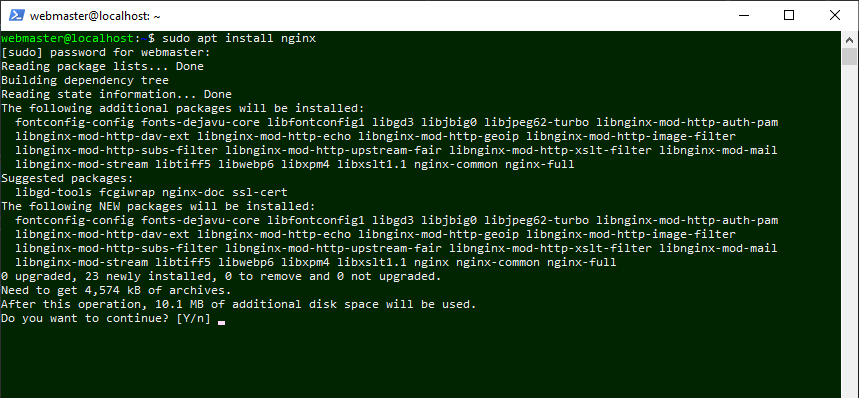

Bekräfta för att installera nginx.

Starta en webbläsare och ange ip-adressen *http://172.104.246.137*. Om installationen av nginx är rätt kommer en sida visas men den informationen. 

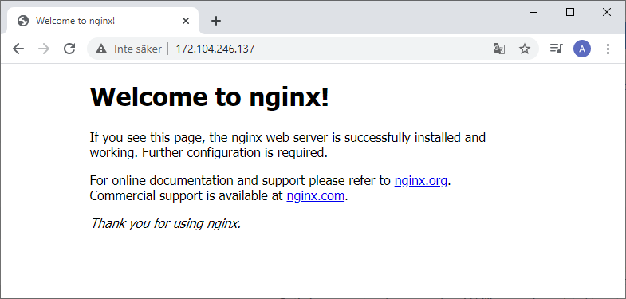

Kommando som visar status för nginx.

`sudo systemctl status nginx`;

Andra kommandon som du kan ange är ex *stop start reload restart enable disable*. 


---

## Skapa en webbplats för statisk html

---


***site1***

- port: 8081 
- sökväg: /var/www/site1 

Skapa mapp för webbplatsens filer.

`sudo mkdir -p /var/www/site1`


För att skapa filer i Debian kan kommandot touch användas, eller kan du alternativt låta editorn nano skapa filen.
Skapa index.html "Hello World".

`sudo nano /var/www/site1/index.html`

I index.html anger du kod för en grundläggande html sida. Skriv "Hello World" i body elementet.


*index.html*
```
<html>
<head>
    <title>Hello World</title>
</head>
<body>
    <h1>Hello World</h1>
</body>
</html>
```

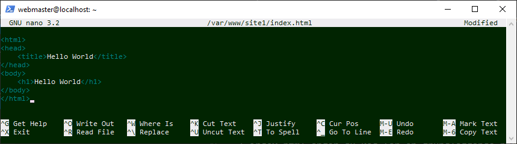

I editorn sparar du filen med `ctrl+k` och bekräftar filnamnet med `y`.

Webbserver nginx finns i mappen `/etc/`. Webbplatser utgår från konfigurationsfiler som finns placerad i mappen *sites-available*.
Se katalogstrukturen genom att navigera till mappen för nginx.

`cd /etc/nginx`

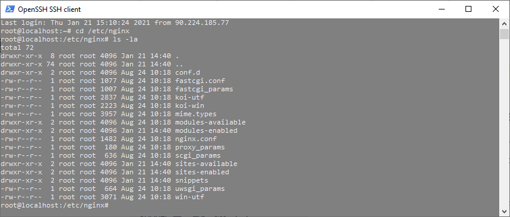


Skapa en ngninx konfigurationsfil för site1.

`nano /etc/nginx/sites-available/site1.conf`

I filen anges portnummer och sökvägar.


*site1.conf*
```
server {
    listen         8081;
    listen         [::]:8081;
    server_name    site1 172.104.246.137;
    root           /var/www/site1;
    index          index.html;

    location / {
      try_files $uri $uri/ =404;
    }
}
```

Aktivera webbplatsen genom att länka filen i nginx. 

`sudo ln -s /etc/nginx/sites-available/site1.conf /etc/nginx/sites-enabled/`

Kontrollera konfigurationsfilen.

`sudo nginx -t`

Ladda om nginx för att webbplatsen ska visas.  

`sudo nginx -s reload`

Starta en webbläsare och ange ip-adressen *http://172.104.246.137:8081*. Nu bör du se Hello World filen du skapade.
 
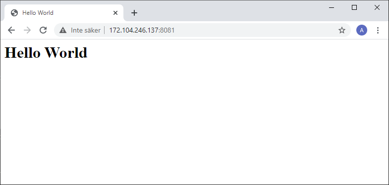


---


## Skapa en webbplats med stöd för PHP, MariaDB, Wordpress  

***site2***

- port: 8082 
- sökväg: /var/www/site2

Den här guiden är uppdelad i 3 delar.

#### Del 1: PHP

Installera stöd för serverspråket PHP.

`sudo apt install php-fpm`

Kommandot installera aktuell version som finns i Debians repo.

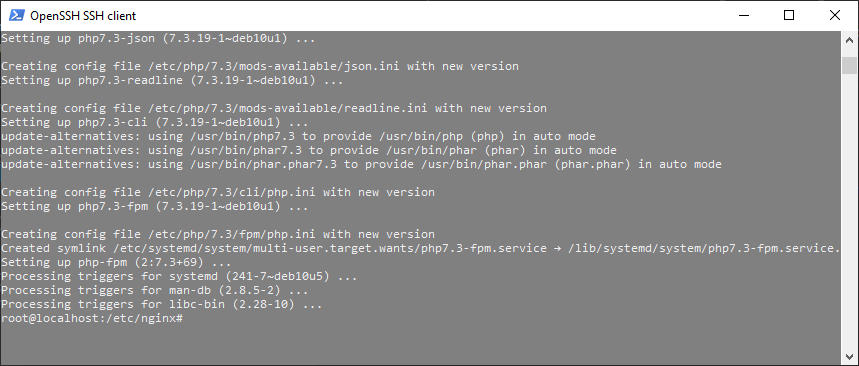


Visa version av PHP.

`php -v`

Ange sökvägar i inställningsfilen för PHP (*php.ini*). Kontrollera att versionsnummer överensstämmner (redigera ev i koden nedan - se /etc/php/*7.3*/). I *php.ini* finns flertalet inställningar för om hur PHP funktioner är aktiva eller inte.

`sudo sed -i 's/;cgi.fix_pathinfo=1/cgi.fix_pathinfo=0/g' /etc/php/7.3/fpm/php.ini`

Ladda om php.

`sudo systemctl restart php7.3-fpm`

Skapa mapp för webbplatsens filer.

`sudo mkdir -p /var/www/site2`

Skapa filem phpinfo.php som visar information om php version.

`sudo nano /var/www/site2/phpinfo.php`

I filen används php kommandot `phpinfo();`


*phpinfo.php*
```
<?php
phpinfo();
?>
```

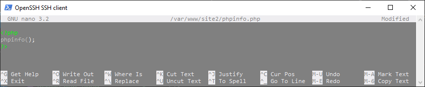


Skapa en ngninx konfigurationsfil för site2.

`nano /etc/nginx/sites-available/site2.conf`

I filen anges portnummer och sökvägar för att nginx ska hantera php filer. I index anges index.php före index.html.
Se till att rätt version av php finns i sökvägen för fastcgi_pass `unix:/run/php/php7.3-fpm.sock;`.


*site2.conf*
```
server {
    listen         8082;
    listen         [::]:8082;
    server_name    site2 172.104.246.137;
    root           /var/www/site2;
    index          index.php index.html;

    location / {
      try_files $uri $uri/ =404;
    }

    location ~* \.php$ {
      fastcgi_pass unix:/run/php/php7.3-fpm.sock;
      include         fastcgi_params;
      fastcgi_param   SCRIPT_FILENAME    $document_root$fastcgi_script_name;
      fastcgi_param   SCRIPT_NAME        $fastcgi_script_name;
      include fastcgi.conf;
    }
}
```

Aktivera webbplatsen genom att länka filen i nginx. 

`sudo ln -s /etc/nginx/sites-available/site2.conf /etc/nginx/sites-enabled/`

Kontrollera konfigurationsfilen.

`sudo nginx -t`

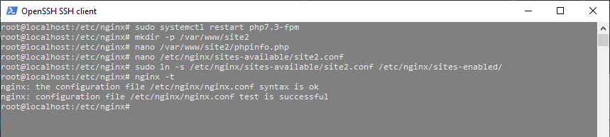


Ladda om nginx för att webbplatsen ska visas  

`sudo nginx -s reload`

Starta en webbläsare och ange ip-adressen *http://172.104.246.137:8082/phpinfo.php*. Nu bör du se en sida som visar information om php versionen.

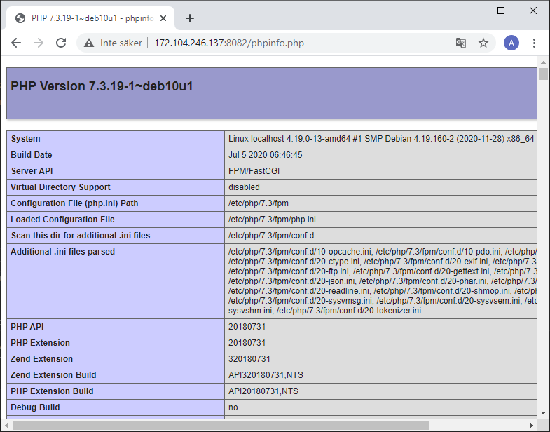

Att accessa ip-adressen utan att ange filnamnet phpinfo.php är status koden 403. I vissa fall kan man vilja tillåta s k *directory listing*. I nginx anger man `autoindex on;`

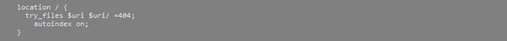


#### Del 2: MariaDB

Installera databasen MariaDB.

`sudo apt install mariadb-server php-mysql`

Kontrollera att du kan logga in i databasen

`sudo mysql -u root`

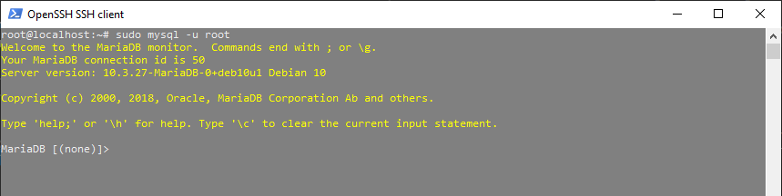


Avsluta sessionen men databasen.

`quit`

Starta en gudie för att öka säkerheten i databasen. Bekräfta och godkänn de alternativen som visas. 

`sudo mysql_secure_installation`

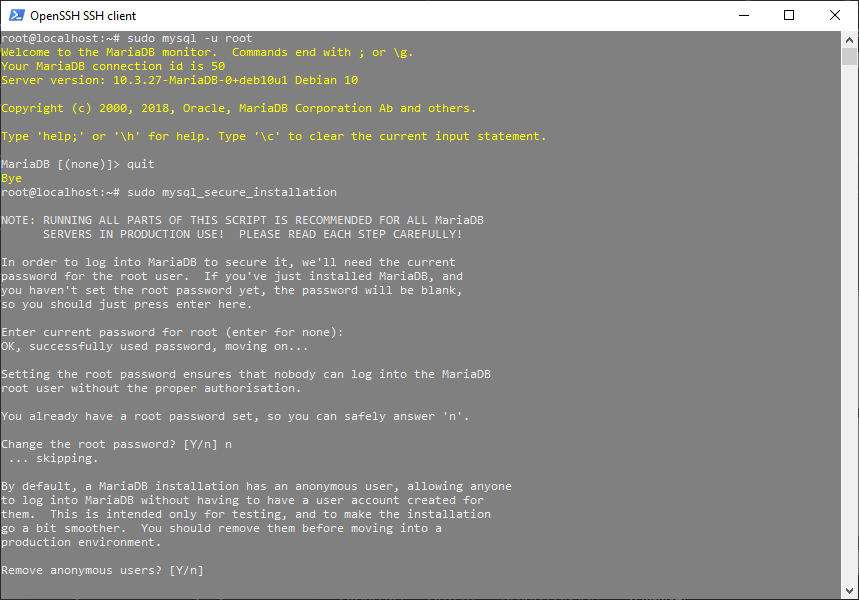


---


#### Del 3: Wordpress

Wordpress installeras genom att ladda ner en installationsfil till webbplatsen. 
För att behålla möjligheten att växla mellan Wordpress och en php-baserad webbplats utan Wordpress, skapar du en underliggande mapp men namnet cms (Content Management System).
Skapa också en mapp med namnet src för installationsfilen(er).

```
sudo mkdir /var/www/site2/cms/
sudo mkdir /var/www/site2/src/
```

Navigera till src mappen.

`cd /var/www/site2/src/`

Ladda ner Wordpress.

`sudo wget http://wordpress.org/latest.tar.gz`

Packa upp installationsfilen.

`sudo tar -xvf latest.tar.gz`

Flytta filerna i Wordpress till cms mappan. 

`sudo mv wordpress/* ../cms`

Visa filerna som finns i mappen */var/www/site2/src/*.

`cd /var/www/site2/cms/`

`sudo ls -la`

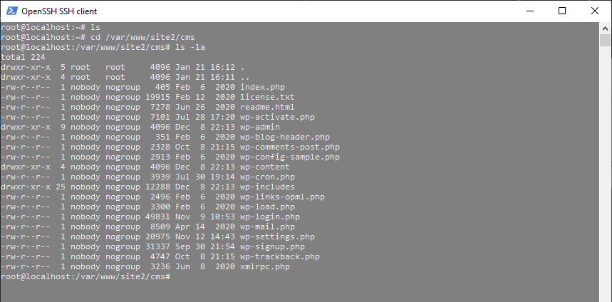

Sätt rättigheter till mappen med wordpress om det saknas. Ett vanligt användarnnamn är `www-data` för den typen av användare. 

`sudo chown -R www-data:www-data /var/www/site2/cms`


**Skapa en databas för wordpress**

Logga in i MariaDB.

`mysql -u root -p`

Skapa en databas.

`CREATE DATABASE db_wordpress;`

Skapa en databasanvändare med ett lösenord. Ange ett lösenord som uppfyller önskvärda krav - inte '*db_passord*'. 

`CREATE USER 'db_user' IDENTIFIED BY 'db_password';`

Ange rättigheter till ny databasanvändare.

`GRANT ALL PRIVILEGES ON db_wordpress.* TO 'db_user';`

Logga ut.

`quit;`

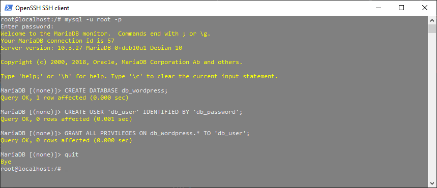


Ändra sökvägen till root i inställningsfilen för site2. Den ska peka på underlggande mappen cms: `root /var/www/site2/cms`;

`nano /etc/nginx/sites-available/site2.conf`


*site2.conf*
```
server {
    listen         8082;
    listen         [::]:8082;
    server_name    site2 172.104.246.137;
    root           /var/www/site2/cms;
    index          index.php index.html;

    location / {
      try_files $uri $uri/ =404;
    }

    location ~* \.php$ {
      fastcgi_pass unix:/run/php/php7.3-fpm.sock;
      include         fastcgi_params;
      fastcgi_param   SCRIPT_FILENAME    $document_root$fastcgi_script_name;
      fastcgi_param   SCRIPT_NAME        $fastcgi_script_name;
      include fastcgi.conf;
    }
}
```

Kontrollera konfigurationsfilen.

`sudo nginx -t`

Ladda om nginx för att webbplatsen med wordpress ska kunna visas.  

`sudo nginx -s reload`

Starta en webbläsare och ange ip-adressen *http://172.104.246.137:8082*. Wordpress har en index.php fil, och nu bör du se en sida som visar att wordpress nu kan konfigureras.
Använd uppgifter som angavs tidigare för databas, användare och lösenord.

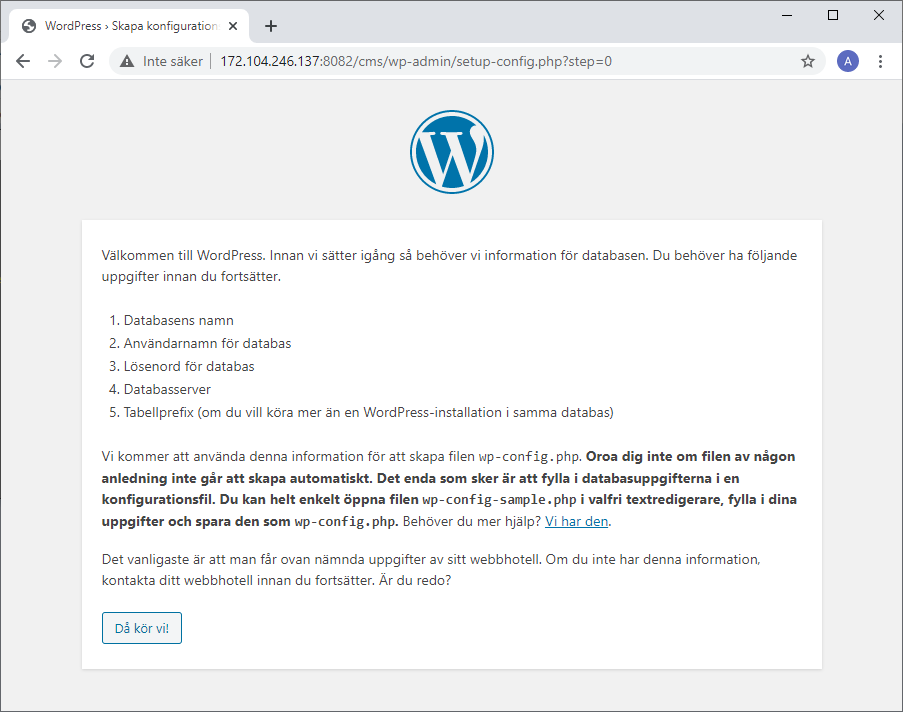


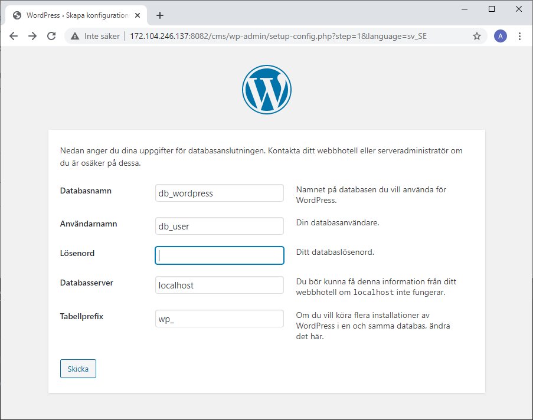


---


## Skapa en webbplats för Node.js med nginx som proxy

***site3***

- port: 8083 
- sökväg: /var/www/site3 


#### Installera Node.js och npm (Node Packet Manager)

Välj version - se nodesource https://github.com/nodesource/distributions/blob/master/README.md

I guiden används Node.js v14.x

Hämta installationsfil för Node.js och installera (inkluderar npm Node Packet Manager).

`curl -sL https://deb.nodesource.com/setup_14.x | bash -`

`apt-get install -y nodejs`

Kontrollera version.

`node -v`

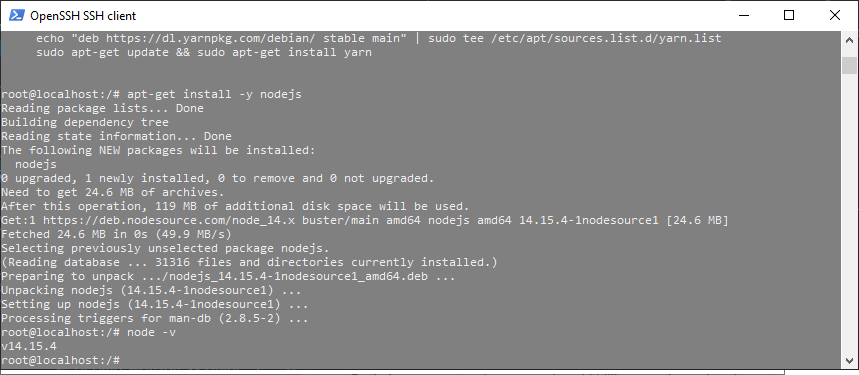


Förbered installation av moduler i Node.js (vissa paket via npm).

`sudo apt install build-essential`

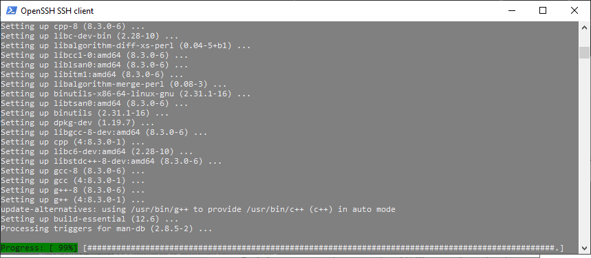


Skapa mapp för webbplatsens filer.

`sudo mkdir -p /var/www/site3`

#### Node.js applikation

Skapa en Hello World (en javascript fil).

`nano /var/www/site3/server.js`

I filen använder du inbyggda modulen http för att visa filer. Se till att applikationen internt använder ett eget portnummer - ex 5000.


*server.js*
```
const http = require('http');

const hostname = 'localhost';
const port = 5000;

const server = http.createServer((req, res) => {
        res.statusCode = 200;
        res.setHeader('Content-Type', 'text/plain');
        res.end('Hello World - nodejs\n');
});

server.listen(port, hostname, () => {
        console.log(`Server running at http://${hostname}:${port}/`);
});
```

#### Se till att Node.js startar automatiskt

Installera processhanteraren *pm2* (globalt).

`sudo npm install -g pm2`

Navigera till mappen med filen server.js

`cd /var/www/site3/`

Starta applikationen med kommandot *pm2*.

`pm2 start server.js`


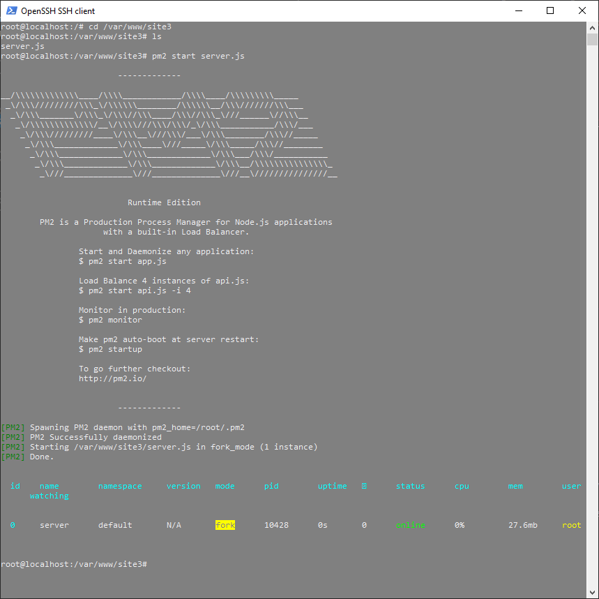


Ange att pm2 automatiskt startar upp appen vid omstart av systemet. 

`pm2 startup systemd`


#### Konfigurera nginx som proxy server

I konfigurationsfilen anges att data som skickas till en port hanteras med det internt portnummer för Node.js appen. 

Skapa en ngninx konfigurationsfil för site3.

`nano /etc/nginx/sites-available/site3.conf`


*site3.conf*

```
server {
    listen         8083;
    listen         [::]:8083;
    server_name    site3 172.104.246.137;

    location / {
        proxy_set_header   X-Forwarded-For $remote_addr;
        proxy_set_header   Host $http_host;
        proxy_pass         http://localhost:5000;
    }
}
```


Aktivera webbplatsen genom att länka filen i nginx. 

`sudo ln -s /etc/nginx/sites-available/site3.conf /etc/nginx/sites-enabled/`

Kontrollera konfigurationsfilen.

`sudo nginx -t`

Ladda om nginx för att webbplatsen ska visas.  

`sudo nginx -s reload`

Starta en webbläsare och ange ip-adressen *http://172.104.246.137:8083*. Nu bör du se en sida som visar Node.js appen.

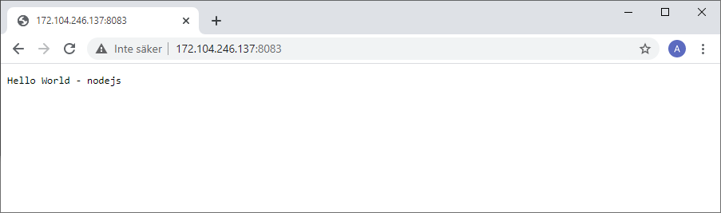

---


## Skapa en webbplats för Deno med nginx som proxy

***site4***

- port: 8084 
- sökväg: /var/www/site4 

Deno är ett runtime program baserat på JavaScript motorn V8. Det har stöd för JavaScript och TypeScript och baserat på programspråket Rust.

Installationsfilen är i zip format och installera zip om det behövs.

`sudo apt install zip`

Installera deno med annat konto än root eftersom deno med fördel placereras i en lokal användarkatalog:

`curl -fsSL https://deno.land/x/install/install.sh | sh`

När deno installerats finns information om hur sökvägen konfigureras. 

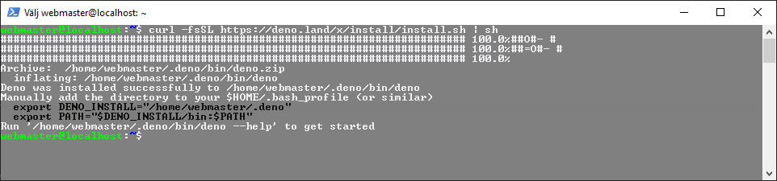

Visa filerna i root katalogen till användarkatalog som är aktuell.

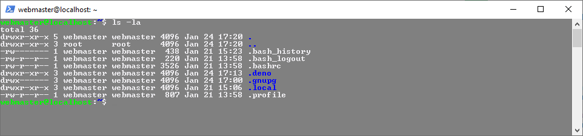


Lägg till sökvägarna manuellt i sist i *.bashrc*


*export DENO_INSTALL="/home/webmaster/.deno"*

*export PATH="$DENO_INSTALL/bin:$PATH"*

`sudo nano $HOME/.bash_profile`

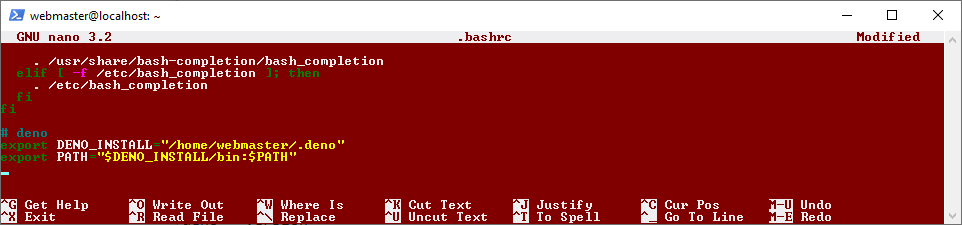

Logga ut från sessionen och logga därefter in. Nu kan du kontrollera vilken version av deno som är installerad.

`sudo den --version`

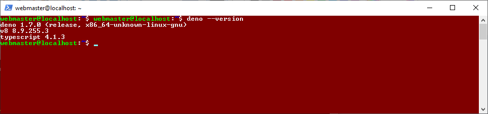

Testa deno med kommandot:

`deno run https://deno.land/std/examples/welcome.ts`

Filen använder metoden console.log(): `console.log("Welcome to Deno!");`


#### deno http server applikation

Skapa mapp för webbplatsens filer.

`sudo mkdir -p /var/www/site4`

Skapa en enkel Hello World applkation (en typescript fil).

`nano /var/www/site4/webserver.ts`

I filen använder du inbyggda modulen http för att visa filer. Se till att applikationen internt använder ett eget portnummer - ex 5500.


*webserver.ts*
```
import { serve } from "https://deno.land/std@0.84.0/http/server.ts";
const s = serve({ port: 5500 });
console.log("http://localhost:5500/");
for await (const req of s) {
  req.respond({ body: "Hello World\n - deno" });
}
```

Starta webservern genom att tillåta servern i nätverket.

`deno run --allow-net /var/www/site4/webserver.ts`

Använd processhanteraren pm2 för att starta webbservern.

`pm2 start /var/www/site4/webserver.ts --interpreter="deno" --interpreter-args="run --allow-net"`

Visa respons från webbservern med curl

`curl http://localhost:5500`;

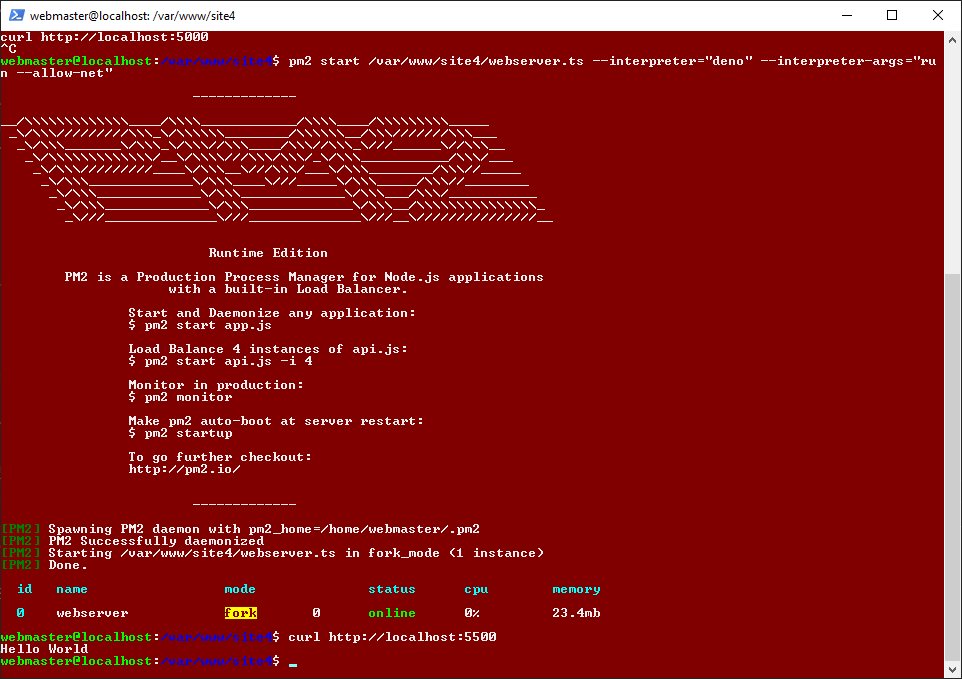


#### Konfigurera nginx som proxy server

I konfigurationsfilen anges att data som skickas till en port hanteras med det internt portnummer för deno appen. 

Skapa en ngninx konfigurationsfil för site4.

`sudo nano /etc/nginx/sites-available/site4.conf`


*site4.conf*

```
server {
    listen         8084;
    listen         [::]:8084;
    server_name    site3 172.104.246.137;

    location / {
        proxy_set_header   X-Forwarded-For $remote_addr;
        proxy_set_header   Host $http_host;
        proxy_pass         http://localhost:5500;
    }
}
```

Aktivera webbplatsen genom att länka filen i nginx. 

`sudo ln -s /etc/nginx/sites-available/site4.conf /etc/nginx/sites-enabled/`

Kontrollera konfigurationsfilen.

`sudo nginx -t`

Ladda om nginx för att webbplatsen ska visas.  

`sudo nginx -s reload`

Starta en webbläsare och ange ip-adressen *http://172.104.246.137:8084*. Nu bör du se en sida som visar Node.js appen.


---