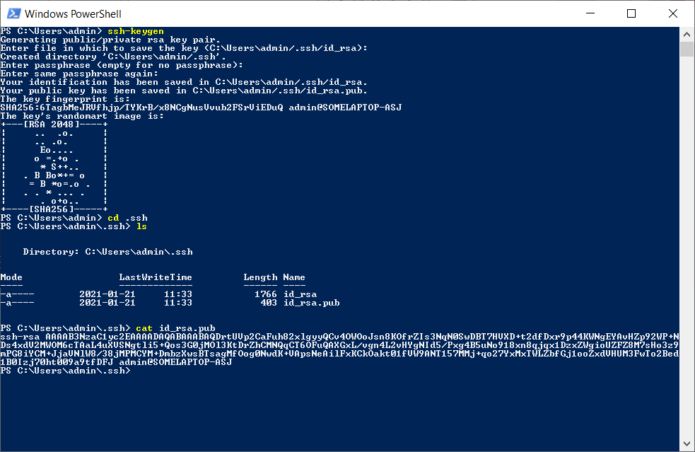
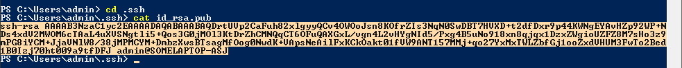
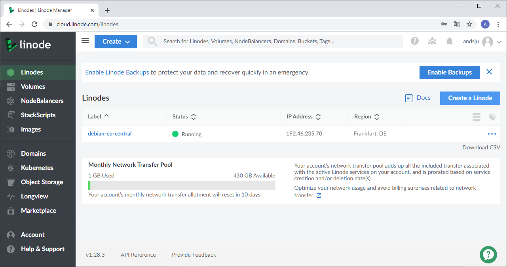
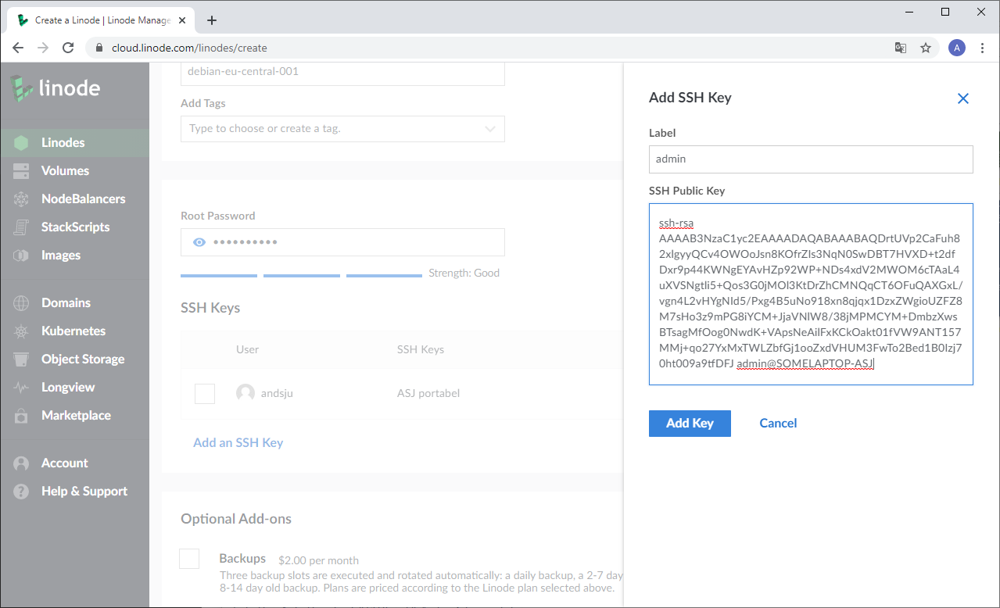
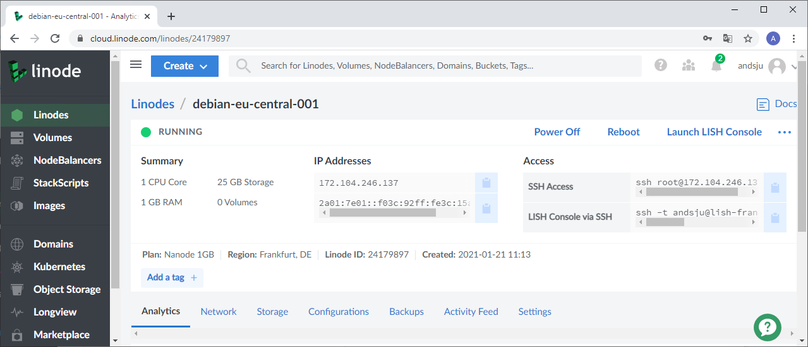
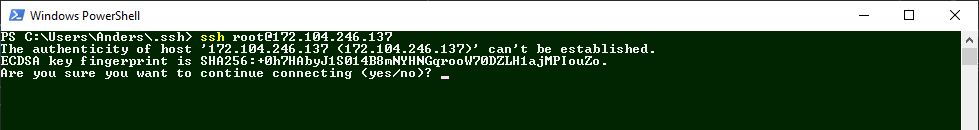
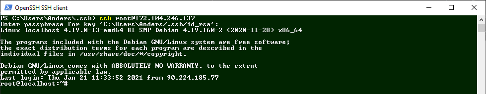
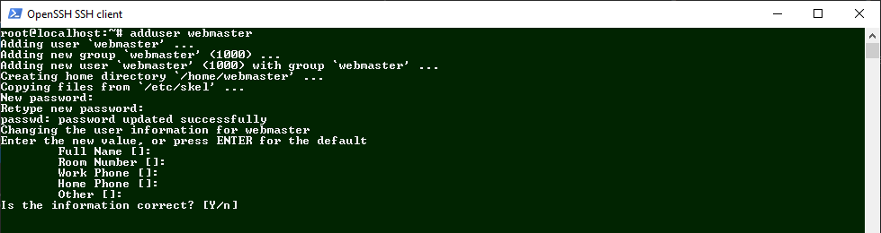

# Installera Debian 10
Debian 10 är en linux distrubtion som kan användas som webbserver. I den här guiden installerar du Debian från grunden.
Guiden utgår från att den lokala datorn har Windows 10 som operativsystem.

## Förbered anslutning till servern med protokollet ssh - Secure Shell
Protokollet ssh krypterar trafik mellan två enheter. Respektive enhet har tillgång till varsin nyckel - en publik och en privat nyckel.

### Steg 1 Starta PowerShell i Windows

Nycklar för ssh protokollet sparas vanligtvis i användarens root katalog.

*Finns mappen .ssh bör du inte generera nya nycklar innan du kontrollerat att de används.*
Se om du har en befintlig mapp med namnet .ssh. Visa filer och mappar: 

`ls`

Visa rättigheter till filer och mappar:

`ls -la`

### Steg 2 Skapa ssh nycklar
Nycklar för ssh skapas med kommandot `ssh-keygen`. Det går att ange växlar till kommandot för att mer specificera krypteringen. 

`ssh-keygen`

En publik och en privat nyckel skapas. För att öka säkerheten att anges *passphrase*.

När nycklarna är skapade navigerar du in i mappen *.ssh*.

`cd .ssh`

Visa mappens innehåll med ls.

`ls`

Skriv ut den publika nyckeln *id_rsa.pub* till skärmen med kommandot `cat`.

`cat id_rsa.pub`

Den publika nyckeln kan nu markeras och kopieras.

### Installera Debian 10
I guiden används linode.com. När du är inloggad i linode kan du göra följande:

Skapa en webbserver genom att klicka "Create a Linode".

Välj Debian 10, och ange en regiion nära dig. Välj en delat CPU och den enklaste varianten i listan. Ange ett lösenord till root för inloggning i den server som ska skapas. Skapa ett lösenord som uppfyller kraven.

Lägg till ssh nyckel genom att klicka "Add an SSH Key". Här klistar du in den nyckel som du kopierade i steg 2. 
Spara nyckeln och slutför guiden genom att klicka "Create".

Servern skapas och du kommer se information om status, resurser, IP-adress och SSH Access

Kopiera koden (kommandot) som finns för SSH Access. Kommandot ser ut så här: `ssh root@172.104.246.137`

I PowerShell anger du därefter kommandot. 

`ssh root@172.104.246.137`

När du loggar in från en ny datormiljö  kommer nycklar verifieras och du behöver bekräfta för att ange att webbplatsen ska vara känd.
Ange passphrase som finns till ssh nyckeln du skapat.

När du är inloggad på servern kommer du se att du är inloggad som root@localhost.

---

I en webbservermiljön finns flera inställningar som du kan göra för att säkra upp servern. Vanligt är att root kontot som du är ansluten med endast används för övergripande åtgärder - som att uppdatera och underhålla systmemet.

För att hantera webbserver funktioner bör du skapa ett konto - i guiden ett konto med namnet *webmaster*.

Skapa användaren webmaster

`adduser webmaster`

Skapa ett lösenord. Frågor som följer kan du ange information vid behov.

Lägg till användaren i gruppen sudo - ger utökade rättigheter 

`adduser webmaster sudo` 

Nu kan du logga in i Debian med två konton:

`ssh root@172.104.246.137`
`ssh webmaster@172.104.246.137`

För att använda utökade rättigheter som webmaster inleds kommandon med `sudo`, ex för att visa dolda filer:

`sudo ls -la` 

Logga ut från root kontot.

`exit`

Andra steg för att öka säkerheten är att konfigurera en brandvägg som lyssnar på ett fåtal portar.